.

# Summary
Simple measures of disagreement in expected inflation from the Michigan survey of consumers, the FRB New York survey of consumer expectations, and the ECB consumer expectations survey. This dataset was collated from public sources, so it can be **freely used** by other researchers.

The dataset will be updated regularly to reflect the latest data.
- **Vintage 1:** The dataset was last updated in May 2025 of 2024 to cover data that ended in 2025:03 (MSC), 2024:05 (SCE), and 2025:04 (CES), ECB Euro area HICP by country (2025:04)

---

# Authors and Reference:
[Household Disagreement About Expected Inflation](https://personal.lse.ac.uk/reisr/papers/24-FPRdisagree.pdf) (2024). In *The Research Handbook of Inflation* edited by Guido Ascari and Riccardo Trezzi, Edward-Elgar, chapter 15.
[bibtex](https://personal.lse.ac.uk/reisr/papers/24-FPRdisagree-bib.bib)
- [Salomé Fofana](https://www.salomefofana.com)
- [Paula Patzelt](https://www.paulapatzelt.com)
- [Ricardo Reis](https://www.r2rsquared.com/)

---

# Full Dataset
Download in three formats:
- [Excel](fpr_disagree_0525.xlsx) (with meta data)
- [csv](fpr_disagree_0525.csv)
- [dta](fpr_disagree_0525.dta)

---

# Variables
The data is at the monthly frequency, and was built directly from the public access micro data files of answers.
<table>
  <tr style="background-color: #d4f4d3;">
    <th style="border: 2px solid #68b684; padding: 8px;">Column</th>
    <th style="border: 2px solid #68b684; padding: 8px;">Description</th>
  </tr>
  <tr style="background-color: #f5f5f5;">
    <td style="border: 2px solid #68b684; padding: 8px;"><code>date</code></td>
    <td style="border: 2px solid #68b684; padding: 8px;">Month year</td>
  </tr>
  <tr style="background-color: #d4f4d3;">
    <td style="border: 2px solid #68b684; padding: 8px;"><code>mean_fcast</code></td>
    <td style="border: 2px solid #68b684; padding: 8px;">Mean of answers</td>
  </tr>
  <tr style="background-color: #d4f4d3;">
    <td style="border: 2px solid #68b684; padding: 8px;"><code>med_fcast</code></td>
    <td style="border: 2px solid #68b684; padding: 8px;">Median of answers</td>
  </tr>
  <tr style="background-color: #d4f4d3;">
    <td style="border: 2px solid #68b684; padding: 8px;"><code>st_dev</code></td>
    <td style="border: 2px solid #68b684; padding: 8px;">Standard deviation of answers</td>
  </tr>
  <tr style="background-color: #f5f5f5;">
    <td style="border: 2px solid #68b684; padding: 8px;"><code>skew</code></td>
    <td style="border: 2px solid #68b684; padding: 8px;">Skewness coefficient of answers</td>
  </tr>
  <tr style="background-color: #d4f4d3;">
    <td style="border: 2px solid #68b684; padding: 8px;"><code>mean_resid</code></td>
    <td style="border: 2px solid #68b684; padding: 8px;">Mean of residualized answers</td>
  </tr>
  <tr style="background-color: #d4f4d3;">
    <td style="border: 2px solid #68b684; padding: 8px;"><code>med_resid</code></td>
    <td style="border: 2px solid #68b684; padding: 8px;">Median of residualized answers</td>
  </tr>
  <tr style="background-color: #d4f4d3;">
    <td style="border: 2px solid #68b684; padding: 8px;"><code>st_dev_resid</code></td>
    <td style="border: 2px solid #68b684; padding: 8px;">Standard deviation of residualised answers</td>
  </tr>
  <tr style="background-color: #f5f5f5;">
    <td style="border: 2px solid #68b684; padding: 8px;"><code>skew_resid</code></td>
    <td style="border: 2px solid #68b684; padding: 8px;">Skewness of residualised answers</td>
  </tr>
  <tr style="background-color: #f5f5f5;">
    <td style="border: 2px solid #68b684; padding: 8px;"><code>*_"survey"</code></td>
    <td style="border: 2px solid #68b684; padding: 8px;">Expectations survey (Michigan - msc, Fed SCE - sce, ECB CES - ecb)</td>
  </tr>
  <tr style="background-color: #f5f5f5;">
    <td style="border: 2px solid #68b684; padding: 8px;"><code>*_lt</code></td>
    <td style="border: 2px solid #68b684; padding: 8px;">Long-term expectations (Michigan - 5y, Fed SCE - 3y, ECB CES - 3y)</td>
  </tr>
  <tr style="background-color: #f5f5f5;">
    <td style="border: 2px solid #68b684; padding: 8px;"><code>*_ma</code></td>
    <td style="border: 2px solid #68b684; padding: 8px;">Moving average (9-month, centred)</td>
  </tr>
</table>

---

# 1-year expectations (as of September 2024)

## US disagreement from the Michigan survey of consumers

### Second moment in US inflation expectations (standard deviation, raw and residualized, last twelve years)

Data for download: [Excel](MSC_stdev.xlsx), [csv](MSC_stdev.csv), [dta](MSC_stdev.dta) 

### Higher moment in US inflation expectations (skewness, raw and residualized, last twelve years)
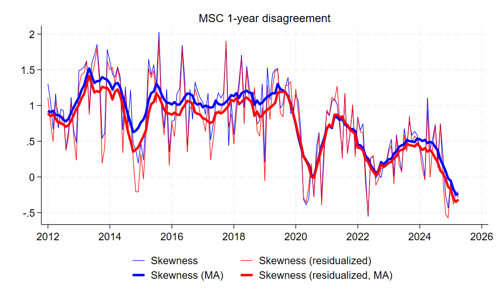

Data for download: [Excel](MSC_skewness.xlsx), [csv](MSC_skewness.csv), [dta](MSC_skewness.dta) 

### First moment in US inflation expectations (mean and median, last ten years)
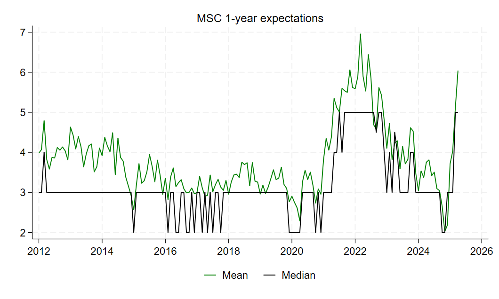

Data for download: [Excel](MSC_mean.xlsx), [csv](MSC_mean.csv), [dta](MSC_mean.dta) 

### Socio-demographic-economic determinants of US inflation expectations (by subsample)

---

## US disagreement in the FRB New York survey of consumer expectations 

### Second moment in US inflation expectations (standard deviation, raw and residualized)

Data for download: [Excel](SCE_stdev.xlsx), [csv](SCE_stdev.csv), [dta](SCE_stdev.dta) 

### Higher moment in US inflation expectations (skewness, raw and residualized)
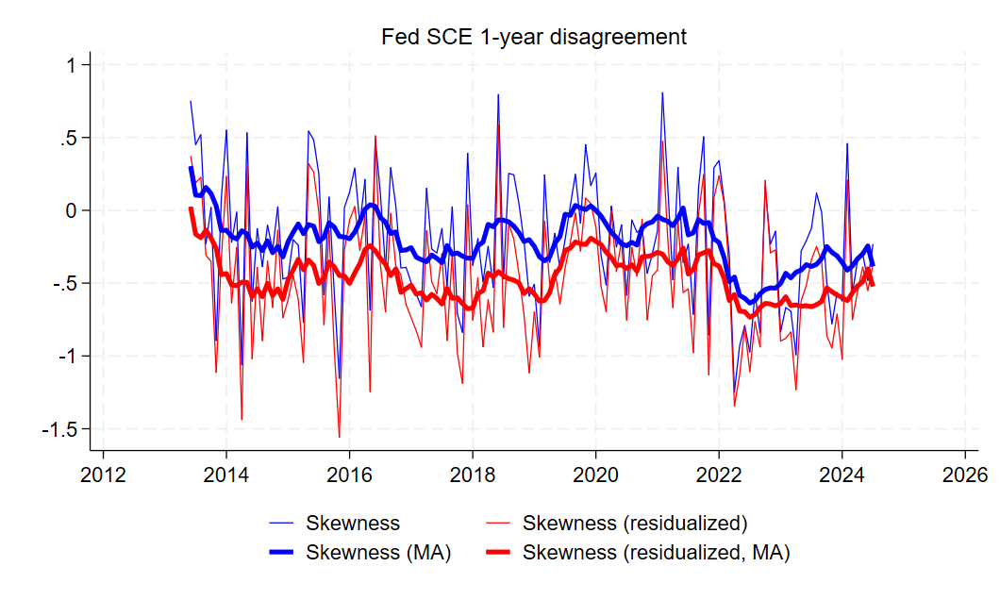

Data for download: [Excel](SCE_skewness.xlsx), [csv](SCE_skewness.csv), [dta](SCE_skewness.dta) 

### First moment in US inflation expectations (mean and median)
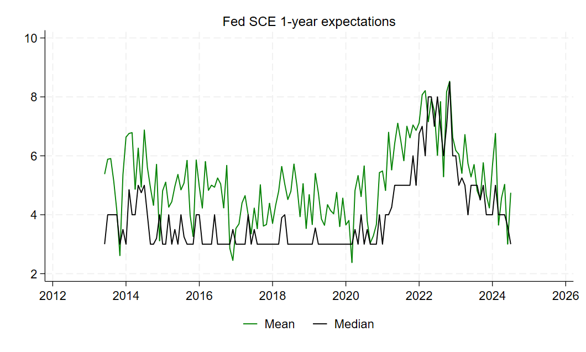

Data for download: [Excel](SCE_mean.xlsx), [csv](SCE_mean.csv), [dta](SCE_mean.dta) 

### Socio-demographic-economic determinants of US inflation expectations (by subsample)

---

## EA disagreement in the ECB consumer expectations survey

### Second moment in EA inflation expectations (standard deviation, raw and residualized)

Data for download: [Excel](ECB_stdev.xlsx), [csv](ECB_stdev.csv), [dta](ECB_stdev.dta) 

### Higher moment in EA inflation expectations (skewness, raw and residualized)

Data for download: [Excel](ECB_skewness.xlsx), [csv](ECB_skewness.csv), [dta](ECB_skewness.dta) 

### First moment in EA inflation expectations (mean and median)
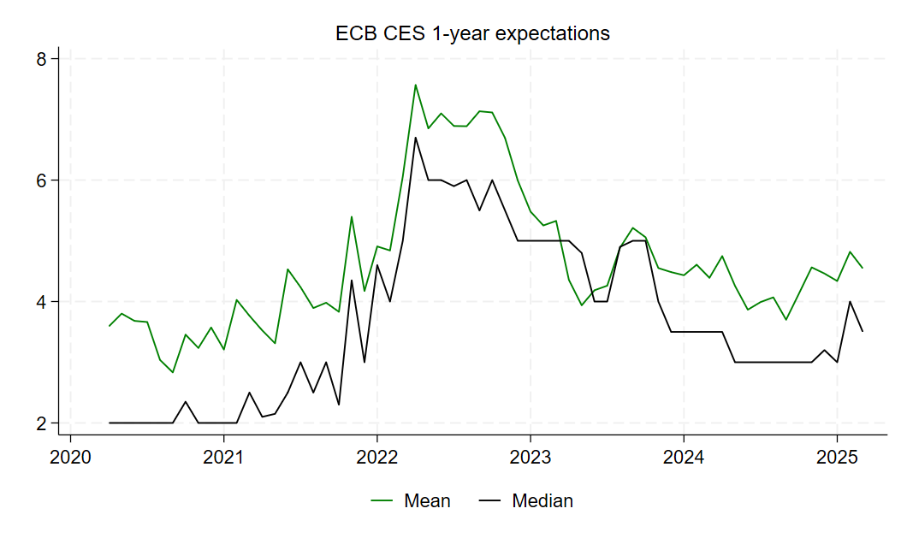

Data for download: [Excel](ECB_mean.xlsx), [csv](ECB_mean.csv), [dta](ECB_mean.dta) 

###  Socio-demographic-economic determinants of EA inflation expectations (by subsample)

---

# Long-term expectations (as of September 2024)

## US disagreement from the Michigan survey of consumers

### Second moment in US inflation expectations (standard deviation, raw and residualized, last twelve years)
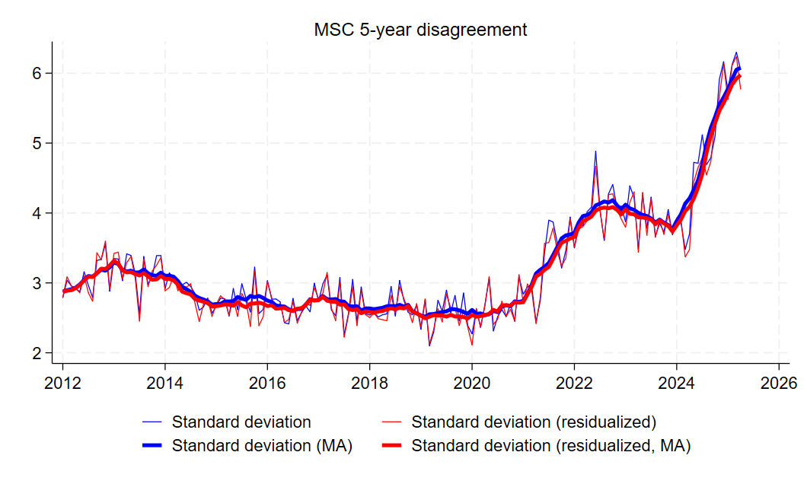

Data for download: [Excel](MSC_stdev_lt.xlsx), [csv](MSC_stdev_lt.csv), [dta](MSC_stdev_lt.dta) 

### Higher moment in US inflation expectations (skewness, raw and residualized, last twelve years)
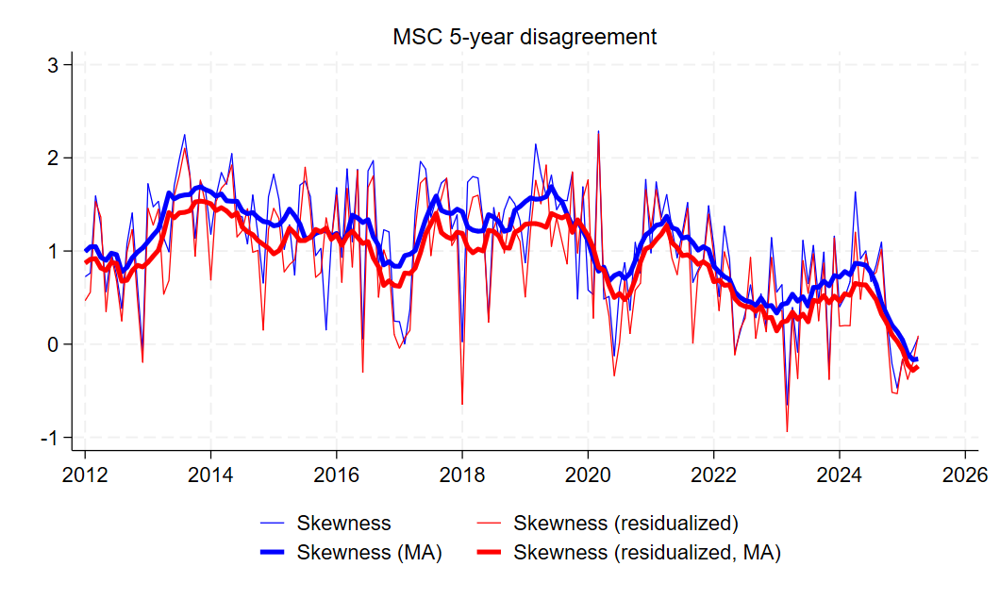

Data for download: [Excel](MSC_skewness_lt.xlsx), [csv](MSC_skewness_lt.csv), [dta](MSC_skewness_lt.dta) 

### First moment in US inflation expectations (mean and median, last ten years)
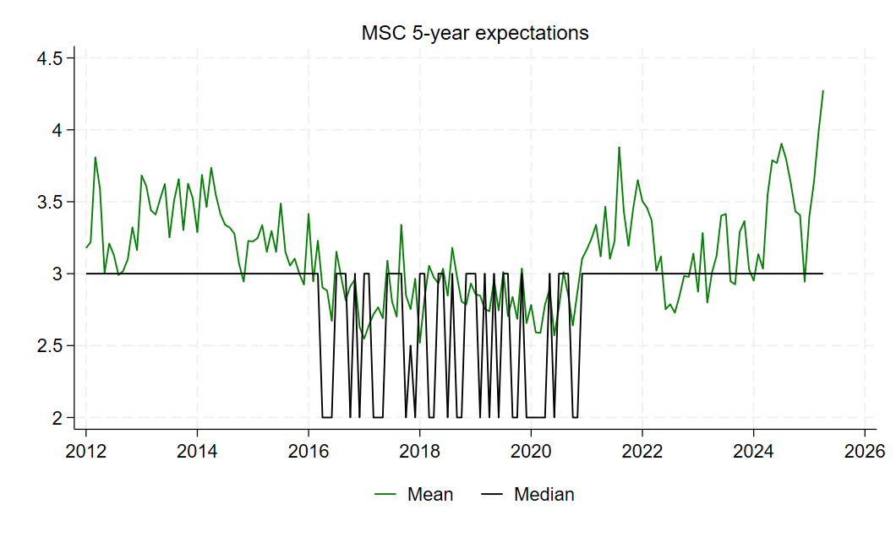

Data for download: [Excel](MSC_mean_lt.xlsx), [csv](MSC_mean_lt.csv), [dta](MSC_mean_lt.dta) 

---

## US disagreement in the FRB New York survey of consumer expectations 

### Second moment in US inflation expectations (standard deviation, raw and residualized)
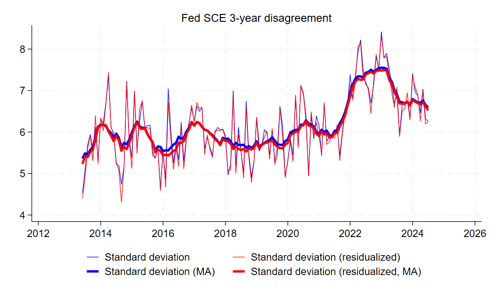

Data for download: [Excel](SCE_stdev_lt.xlsx), [csv](SCE_stdev_lt.csv), [dta](SCE_stdev_lt.dta) 

### Higher moment in US inflation expectations (skewness, raw and residualized)
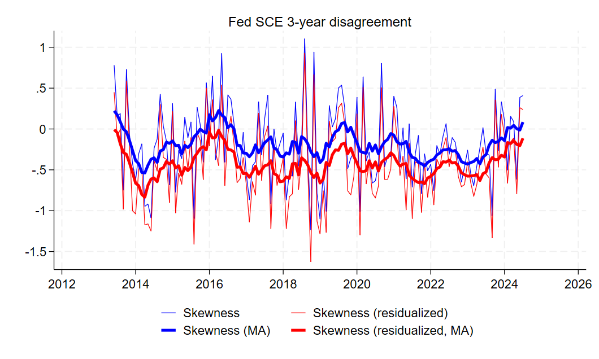

Data for download: [Excel](SCE_skewness_lt.xlsx), [csv](SCE_skewness_lt.csv), [dta](SCE_skewness_lt.dta) 

### First moment in US inflation expectations (mean and median)
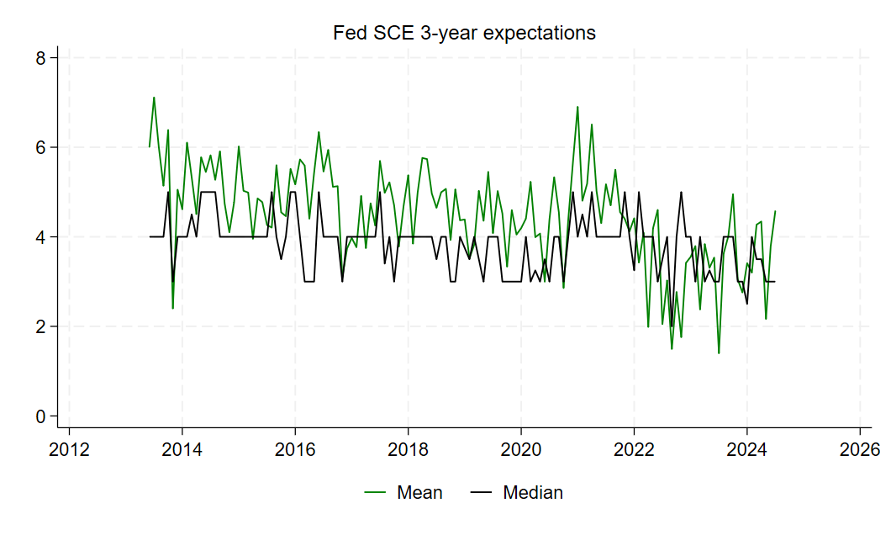

Data for download: [Excel](SCE_mean_lt.xlsx), [csv](SCE_mean_lt.csv), [dta](SCE_mean_lt.dta) 

---

## EA disagreement in the ECB consumer expectations survey

### Second moment in EA inflation expectations (standard deviation, raw and residualized)
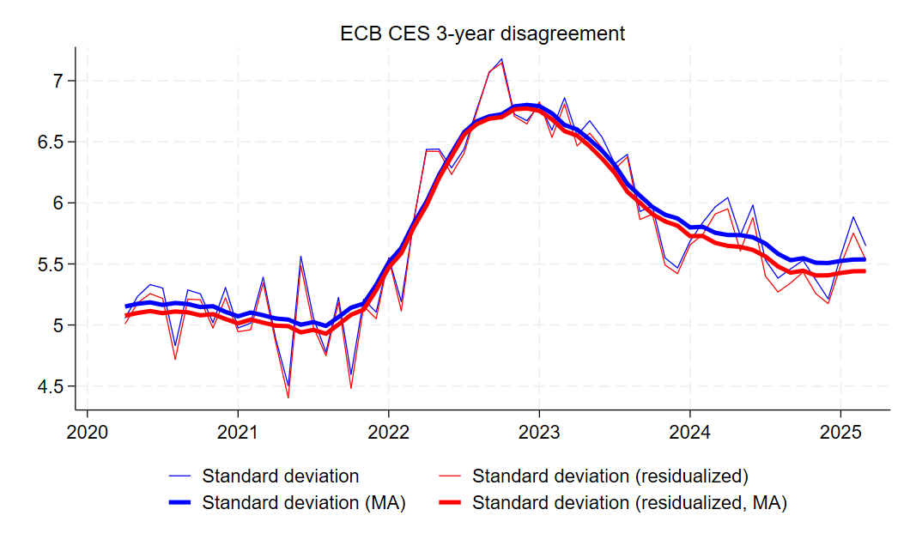

Data for download: [Excel](ECB_stdev_lt.xlsx), [csv](ECB_stdev_lt.csv), [dta](ECB_stdev_lt.dta) 

### Higher moment in EA inflation expectations (skewness, raw and residualized)
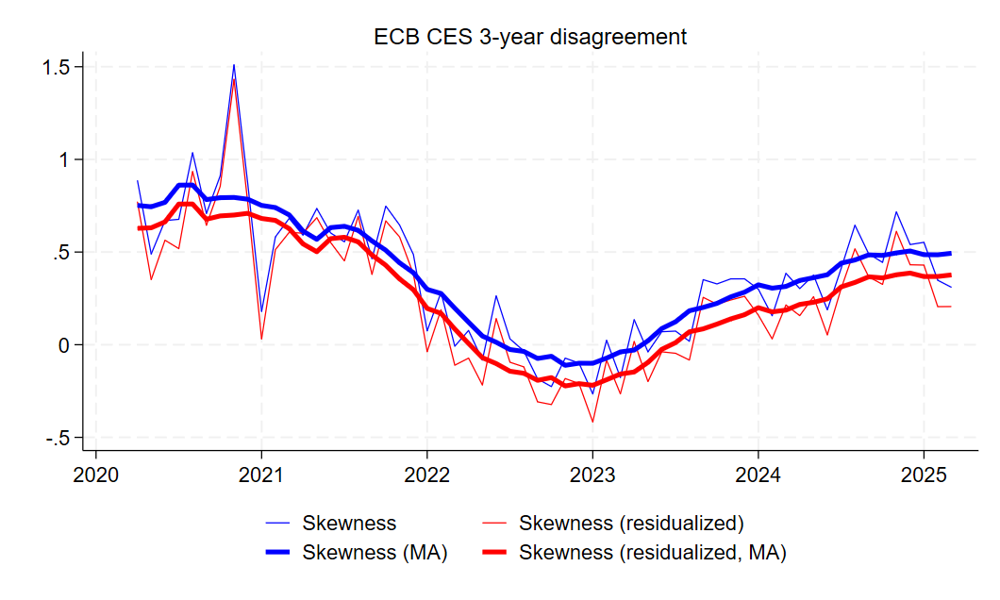

Data for download: [Excel](ECB_skewness_lt.xlsx), [csv](ECB_skewness_lt.csv), [dta](ECB_skewness_lt.dta) 

### First moment in EA inflation expectations (mean and median)
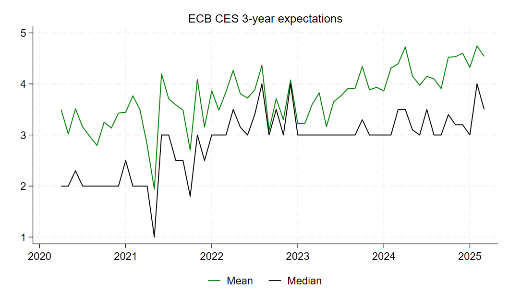

Data for download: [Excel](ECB_mean_lt.xlsx), [csv](ECB_mean_lt.csv), [dta](ECB_mean_lt.dta) 

---

# Usage
Please cite if use, and e-mail the authors with suggested corrections.
